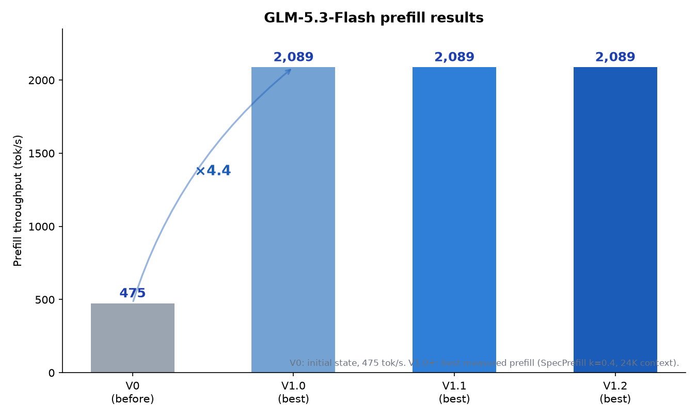
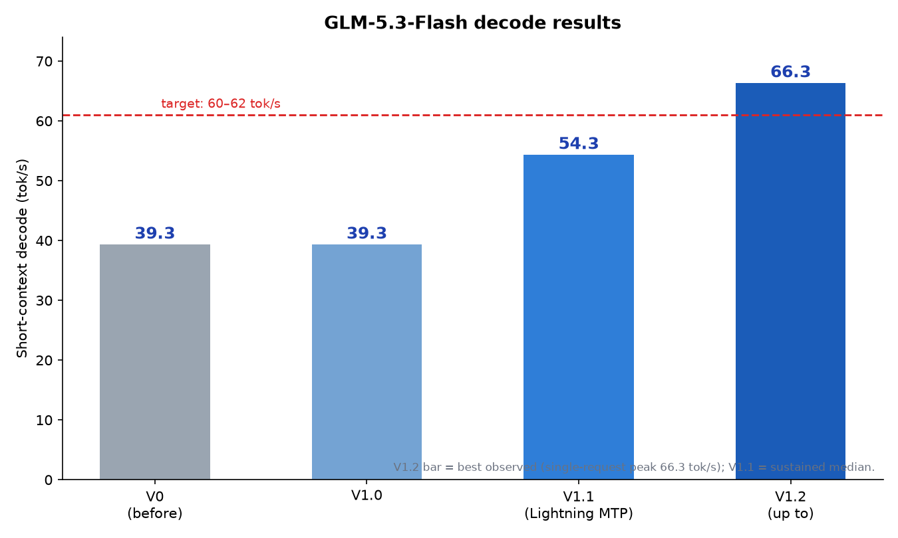

# glm53-flash-apple-silicon

**Making GLM-5.3-Flash fast on Apple Silicon (M5 Ultra, 256 GB) — a receipted engineering log for prefill optimisation and decode advancement.**

Everything here is measured on real hardware with archived receipts. No hand-waving, no benchmarks-vibes. If a hypothesis died, the corpse is on display. If a number is claimed, a log line or JSON backs it.

## Results at a glance

## Starting point (V0, measured)

| Metric | Value |
|---|---|
| Prefill @ ~24K tokens | **475 tok/s** |
| Decode (short-context) | **~39 tok/s** |

Reference point for context: a 2× NVIDIA DGX Spark cluster running the same model (EXL3, tensor-parallel) was measured at ~1,567 tok/s prefill.

## Result (measured, after this work)

| Metric | V0 | V1.2 | |
|---|---|---|---|
| Prefill @ 16K | 475* | **1,630 tok/s** | ×1.9 |
| Prefill @ 24K | 475* | **2,089 tok/s** | ×4.4 |
| Prefill @ 32K | 475* | **2,018 tok/s** | ×4.1 |
| Prefill @ 56K | 475* | **2,040 tok/s** | ×4.3 |
| Decode (short-ctx) | ~39 tok/s | **55.2 nominal / 66.3 best observed** | ×1.4–1.7 |
| Long-context degradation | knee + 30% drop by 35K | **flat to 56K+** | — |

\* V0 prefill context length unrecorded; 475 tok/s is the verified initial-state figure. Later full-fidelity measurements at matched context: ~880–1,030 tok/s.

The headline prefill mechanism is **SpecPrefill**: a draft-model scores token importance and the target prefills only the ~40% most important tokens. It is an *approximate* mode — matched-context quality was measured at **0.94 vs 1.00 across six task families** (tool-calling, code editing, arithmetic, summarization at parity; exhaustive fact-recall slightly reduced) — with a one-flag full-fidelity fallback.

The headline decode mechanism is **Lightning MTP** (oMLX 0.7.0rc1): the model's MTP head, mapped from the drafter checkpoint into the nextn decoder layer, speculates tokens that are verified losslessly — **73–81% acceptance, 2.39–2.75 tokens/cycle, prefill unharmed**.

## Minimum performance targets (competitive bars)

These are the bars this project set for "worth shipping" — stated so others can judge the result against the same yardstick:

- **Prefill: ≥ ~1,584 tok/s** at ~24K context (the 2× DGX Spark reference pace)
- **Decode: ≥ ~60–62 tok/s** (parity with competitive serving on this model class)

Prefill clears its bar with ~30% margin in SpecPrefill mode. **Decode clears its bar on best-observed runs (66.3 tok/s) but not on nominal medians (55.2 short / 45.2 mid)** — see Known limitations and BENCHMARKS.md for the full picture.

## V1.2 — decode breakthrough

Lightning MTP (oMLX 0.7.0rc1) lifts decode to a **nominal 55.2 tok/s short-context / 45.2 tok/s mid-context** (n=20 medians), with **66.3 tok/s best observed** — a +40% decode gain over V1 with prefill unharmed.

## Known limitations

- **Decode nominal medians (55.2 short / 45.2 mid) remain below the 60–62 bar**; 66.3 is a best-observed peak, not a median. Decode is also **bimodal at ctx>2K without MTP**: requests land in a fast tier (33.5–33.8 tok/s) or slow tier (23–28 tok/s) — a per-request gate characterized but mechanism unresolved.
- **SpecPrefill is approximate**: 0.94 relative quality vs full fidelity; exhaustive long-context fact recall is where the 60%-token budget shows. First use of the draft scorer after a cold start pays ~60 s one-time.
- **Mixed-4/8-bit checkpoint**: results are for this quantization; other quants will differ.

## What's in here

- **[PROVENANCE.md](PROVENANCE.md)** — what is ours vs upstream vs vendored, exact environment, and per-feature rollback instructions.
- **[LEDGER.md](LEDGER.md)** — the full experiment log: every hypothesis, measurement, verdict, and artifact reference. The interesting part is the *failed* experiments: two fusion programs were proven numerically perfect and 3–6× faster in isolation, yet **measurably neutral end-to-end** — the receipts explain why, and that explanation is the most valuable thing in this repo.
- **[BENCHMARKS.md](BENCHMARKS.md)** — reproducible methodology, canonical results (including V1.2 decode), exact script invocations, versions.
- **[docs/METHOD.md](docs/METHOD.md)** — the ten benchmark traps that produced false results here, each with its fix.
- **[docs/DECODE.md](docs/DECODE.md)** — the decode investigation: bandwidth physics, MTP economics across three engines, kernel-boundary analysis, and the V1.2 update.
- **[docs/ROOT-CAUSES.md](docs/ROOT-CAUSES.md)** — four non-obvious root causes (silent kernel fallback, profiling-window artifact, buffer-pool pathology, dispatch≠GPU-time).
- **[scripts/](scripts/)** and **[patches/](patches/)** — benchmark harnesses and serving-stack patches as reference implementations.
- **[artifacts/](artifacts/)** — preserved raw receipts behind the closure verdicts.

## Headline findings (for the impatient)

1. **oMLX source installs silently run fallback kernels** unless precompiled Metal kernels are present — a 46% long-context prefill difference, invisible in logs.
2. **"GPU idle %"-style system profiling can invert your diagnosis**: a powermetrics sampling window that closed before the workload started read as "GPU 94% idle" when the GPU was actually 88–98% busy.
3. **Dispatch-count ≠ GPU-time**: a component with 41% of all dispatches was ~3% of GPU time; two fusion programs that won their microbenches measured neutral end-to-end.
4. **A per-chunk `mx.clear_cache()` in a draft-model loop cost 130×** under memory pressure — fixed, and the bimodal 0.4↔73 s scorer became flat.
5. **Speculative-prefill quality is task-shaped**: agent-relevant tasks at exact parity; exhaustive fact-recall pays the approximation cost. Gate your own workload.
6. **Decode is bimodal at ctx>2K** (fast tier 33.5–33.8, slow tier 23–28, per-request, launch-independent) — characterized; mechanism unresolved.
7. **Lightning MTP lifts decode +38–43%** (39.3→54.3 short / 48.1 mid in the MTP evaluation; 55.2/45.2 nominal in the confirmed n=20 session).

## Environment

- Mac Studio M5 Ultra (80-core GPU, 256 GB), macOS 27.0
- Python 3.11, MLX 0.32.0, oMLX 0.7.0rc1 (V1.2) / 0.7.0.dev4 (V1.0-era baselines)
- Checkpoint: PipeNetwork GLM-5.3-Flash MLX mixed-4/8-bit (~170 GB)
- Draft checkpoint for SpecPrefill: avlp12/GLM-5.3-Flash-Alis-MTP-Drafter (MTP block reused as a standalone scorer; doubles as the Lightning MTP head in V1.2)
- Native Metal kernels: precompiled binaries transplanted from the official oMLX 0.6.4 DMG (no Xcode Metal toolchain needed)

Individual environment values (hostnames, LAN IPs, ports, paths) are local configuration and intentionally absent — see [docs/METHOD.md](docs/METHOD.md) for what you need to substitute.

## Status

**V1.2** — prefill ×4.4 (475→2,089 @24K effective, quality-gated, fallback intact); decode **66.3 peak / 55.2 nominal** short-context via Lightning MTP (+40%). Reproducible from BENCHMARKS.md. Watch list: MLX PR #4562 (runtime command-buffer limits), oMLX 1.0, new MLX-compatible MTP drafters.

## License / use

Results and methodology free to use and build on. The serving-stack patches reference upstream oMLX/mlx-vlm (Apache-2.0 lineage) — treat them as reference implementations, not drop-in products.
